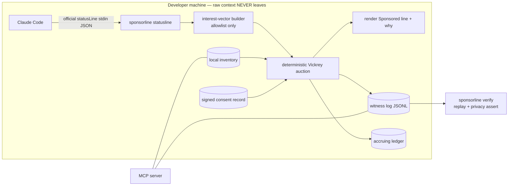

# ADR-0001 — Sponsorline v0.1: The Consent-First Sponsor Line for AI Coding Tools

| | |
|---|---|
| **Status** | Accepted |
| **Date** | 2026-06-14 |
| **Author** | System Architecture (rudycelekli) |
| **Version** | 1.0 |
| **Supersedes** | none |
| **Source patterns** | ProofKit/ProofSeal witness manifest + `verify` kill-switch (`projects/proofkit/`, ADR-0001..0003); ruflo witness toolkit (Ed25519 key derived from commit/salt, ADR-103); RuView Trust Kill Switch (`verify.py`, deterministic harness); agentdb `SolverBandit` (Thompson-sampling feedback loop); OIA decision-log style |

---

## 1. Context — The Monetized Waiting Moment, Done Honestly

A viral project ("Kickbacks") turned the AI-coding "Thinking…" spinner into an ad slot: advertisers bid on the most-watched line of text on a developer's screen, the developer keeps 50%. The idea is sound — the waiting moment is genuinely valuable inventory and developers genuinely want their tooling to pay for itself. The **execution** is the problem, and the problem is the opportunity:

1. **The tampering problem.** The viral implementation patches the vendor's official signed extension bundle and auto-updates every ~90s with no signature check. That is a supply-chain compromise pattern. It is unshippable to anyone who handles client code, which is exactly the developer with money.
2. **The surveillance problem.** "Anonymized intel for targeted ads" in a coding tool means harvesting source, paths, and session content the developer often does not own (it is their employer's / client's IP). Even "anonymized," it is a confidentiality and GDPR/CCPA landmine that every enterprise security team will block.
3. **The trust problem.** An ad network you cannot audit, in the one tool you stare at all day, is creepy by default. Nobody can verify what was shown, why, to whom, or what left their machine.
4. **The proof-of-delivery problem (advertiser side).** Ad networks are riddled with impression fraud. Advertisers pay for impressions they cannot independently verify happened.

Two of our own reference systems already solve the trust substrate: ProofKit/ProofSeal extracts deterministic-output + commit-bound Ed25519 witness manifests + a one-command `verify` kill switch with zero key management. **Sponsorline maps that exact trust substrate onto ad-tech**: every impression is bound to a verifiable consent record, the auction is deterministic and replayable from a witness log, and the only thing that ever leaves the machine is a coarse, inspectable interest vector — never code. The differentiator over "Kickbacks"-class clones is that the honesty is structural and verifiable, not a marketing line; the differentiator over conventional ad SDKs is "the only AI-dev ad network that never sees your code" — the property that makes it adoptable inside an enterprise.

**Sponsorline is not a patch on anyone's binary.** It uses the *sanctioned* extension point Claude Code already ships — the user-configured `statusLine` command — and a generic adapter interface so Codex/Cursor/others become drop-in adapters later. The developer toggles it on explicitly; nothing renders without a signed consent record.

### Scope of the platform vs. scope of v0.1

The full business is six subsystems: (1) surface SDK, (2) auction engine, (3) targeting layer, (4) revenue-share + payouts, (5) advertiser/enterprise portal, (6) trust/privacy proof layer. Per Playbook Rule #6 (one project at a time) and Phase 1 (v0.1 buildable in ≤2 weeks, ONE verifiable claim), v0.1 ships the **keystone**: subsystems 1, 2 (local/deterministic), 3 (local-only), and 6, with a non-paying accruing ledger stub for 4 and an MCP/HTTP inventory endpoint as the seed of 5. Real advertiser money, payouts, KYC, and fraud defense are explicitly **out of v0.1** and deferred to v0.2–v0.3, but every interface in v0.1 is designed with the live marketplace as the known endpoint (§6).

---

## 2. The ONE Verifiable Claim of v0.1

> **"Sponsorline shows a relevant sponsor line in your AI coding tool that never sees your code, never renders without your signed consent, and runs a provably-fair second-price auction — and a stranger can verify all three from a clean clone in one command (`npx sponsorline verify`) in under 2 seconds."**

Decomposed into testable sub-claims that `bench/` and CI must demonstrate:

| # | Sub-claim | Proof mechanism |
|---|---|---|
| C1 | **Privacy**: the auction request payload contains zero code/path/file-content bytes — only an allowlisted interest vector (versioned schema) | `bench/privacy` egress capture on 3 fixture repos; payload validated against the allowlist schema; any field outside the allowlist → fail. Negative test injects code/paths and asserts they are absent from egress. |
| C2 | **Consent-bound**: no impression is ever recorded or rendered without a valid, unexpired, signed consent record; revocation (`sponsorline off`) takes effect immediately | Fault suite: missing/expired/tampered consent record each → plain line, zero impression logged. Tamper of consent signature → `verify` exit 1. |
| C3 | **Fairness/determinism**: deterministic second-price (Vickrey) auction; identical seed+bids → identical winner & clearing price; 100% reproducible; `verify` re-derives every historical auction from the witness log | `bench/fairness` 1000 seeded auctions replayed; outcome hash must match. Baseline B1 (`Math.random` selection) is non-reproducible by construction. |
| C4 | **One-command stranger verification < 2 s** (cold Node start included) on a 1000-impression witness log | `bench/latency` 20 seeded runs; p95 < 2000 ms. |
| C5 | **Never breaks the editor**: any internal error in the statusline path degrades to the exact official plain line (never a crash, never a stack trace in the status bar) | Fault-injection: throw at each stage (config read, vector build, auction, seal, render) → assert plain-line output + exit 0. |
| C6 | **50/50 split integrity**: every accrued impression credits the developer exactly 50% of the clearing price in the ledger; ledger total reconciles to the witness log | `bench/ledger` reconciliation over 1000 impressions; developer balance == 0.5 × Σ clearing prices, exact integer math (no float drift). |

The README claim will be copy-pasted *from* the benchmark report (Playbook Rule #2b / Anti-Failure Rule: never write the claim first).

---

## 3. Benchmark Definition (MANDATORY)

### 3.1 Named baselines

| Baseline | What it represents | Pinned |
|---|---|---|
| **B1: naive ad selection** | The folk implementation: `Math.random()` pick from inventory, no consent gate, contextual data sent server-side (the "Kickbacks-class" model) | in-repo reference impl `bench/baselines/naive/` |
| **B2: typical contextual ad SDK** | Capability reference for a conventional client-side ad SDK that reads page/app context and sends it to an ad server (e.g., GPT-style request with contextual signals) | capability comparison only (no code run; documented capability matrix per Rule #8) |

Where a baseline structurally cannot express a capability (B1 has no consent record, no witness log, no replay; B2 sends raw context off-device), the table records **N/A — capability absent / privacy-incompatible**, which is itself a benchmark result. Per Rule #8, the comparison is framed as **"adoption cost, privacy, and verifiability"**, not as percentages on our own taxonomy, and the announce post leads with the pain story, never the table.

### 3.2 Metrics

1. **Egress payload contents** (bytes of code/path/content that leave the machine — target: 0; field-level allowlist conformance)
2. **Auction reproducibility** (% of replayed auctions whose outcome hash matches — target: 100%)
3. **Verify latency** (p50/p95 over 20 runs, 1000-impression log, cold process — target p95 < 2 s)
4. **Statusline render overhead** (added p95 ms vs the official no-ad statusline, warm cache — measured, copied to README)
5. **Consent-gate completeness** (% of invalid-consent fault cases that correctly render the plain line and log zero impressions — target: 100%)
6. **Ledger reconciliation error** (|developer balance − 0.5 × Σ clearing prices| — target: exactly 0, integer math)
7. **Capability coverage** (consent record, witness log, auction replay, off-device privacy, per-impression `why`: yes/no per tool)

### 3.3 Dataset / protocol

- **Three fixed fixture repos** vendored under `bench/fixtures/` (committed, never fetched), used as the developer's "open project" to drive interest-vector extraction:
  - `repo-a-ts-lib` — TypeScript library (manifests: `package.json`, `tsconfig.json`) → interest: `lang:ts`, `framework:none`, broad task category.
  - `repo-b-py-ml` — Python ML project (`requirements.txt`, `pyproject.toml`) → interest: `lang:py`, `framework:pytorch`.
  - `repo-c-rust-cli` — Rust CLI (`Cargo.toml`) → interest: `lang:rust`, `framework:clap`.
- **Seeded local inventory** of N sponsor entries with category targeting + bids, committed under `bench/fixtures/inventory.json`.
- **Protocol:** clean clone into temp dir → run consent wizard non-interactively (`--accept-defaults`) → drive 1000 statusline renders across fixtures (seed = 42, render list committed) → replay auctions from the witness log → run the privacy egress capture + invalid-consent fault suite → emit report. All seeds, versions, OS, Node version recorded as provenance. Runs on macOS + Linux CI runners.

### 3.4 Exactly what `bench/` emits

`bench/run.mjs` writes `bench/results/report.md` + `report.json` with a provenance block (git SHA, seed, OS, Node version, wall-clock) and this table:

```
| Metric                              | Sponsorline | naive (B1) | contextual SDK (B2) |
|-------------------------------------|-------------|------------|---------------------|
| Code/path bytes in egress (count)   |             |            |                     |
| Auction reproducibility (%)         |             |            |                     |
| Verify latency p50 / p95 (ms)       |             |            |                     |
| Statusline render overhead p95 (ms) |             |            |                     |
| Invalid-consent → plain line (%)    |             |            |                     |
| Ledger reconciliation error         |             |            |                     |
| Consent record / witness / replay   |             |            |                     |
```

plus a per-fixture slice breakdown and sample `why`-explanations + sample fault annotations — the RuView/AetherArena report pattern.

---

## 4. Endpoint Surface (every capability externally callable + integration-tested)

### 4.1 CLI (`npx sponsorline <cmd>`, bin: `sponsorline`)

| Command | Purpose | Exit codes |
|---|---|---|
| `sponsorline init` | Consent wizard (granular per-signal toggles), derive device key, write signed consent record + Claude Code `statusLine` config; idempotent | 0 / 2 |
| `sponsorline statusline` | The command Claude Code invokes (official stdin JSON contract). Build local interest vector → auction → emit one labeled "Sponsored" line; on ANY error emit the plain official line | 0 always (never breaks editor) |
| `sponsorline why [--last]` | Per-impression transparency: which signals were used, which advertiser won, clearing price, consent record id, witness entry hash | 0 / 2 |
| `sponsorline earnings [--json]` | Ledger view: accrued developer balance, impression count, reconciliation status | 0 / 2 |
| `sponsorline verify [--log <p>] [--json]` | Stranger command: validate consent signatures + re-derive every auction from the witness log + assert privacy schema over recorded egress | 0 ok, 1 tamper/regression, 2 precondition |
| `sponsorline off` | Immediate revocation: remove statusLine config + mark consent revoked; subsequent renders are plain | 0 |

The reporting commands (`why`, `earnings`, `verify`) support `--json` for machine-readable output. `statusline` instead speaks Claude Code's official plain-stdout contract (emitting JSON there would corrupt the status bar), and `init`/`off` are actions that communicate through exit codes. The verify exit-code contract (0/1/2 with machine-parseable `precondition` reasons) is adopted from ProofKit/ruflo.

### 4.2 MCP tools (stdio server, `sponsorline mcp start`) — the advertiser/enterprise seam

| Tool | Maps to |
|---|---|
| `advertiser_submit_inventory` | Validate + register sponsor inventory entries (category, creative text ≤ N chars, bid) into local inventory store |
| `auction_simulate` | Run a deterministic auction for a given interest vector + seed; return winner, clearing price, full trace |
| `earnings_summary` | `earnings --json` |
| `verify_run` | `verify --json` |

### 4.3 npm library (`@sponsorline/core`)

Pure functions, no I/O: `buildInterestVector(signals, allowlist)`, `runAuction(bidders, vector, seed)`, `seal(entry, key)` / `verifyLog(log)`, `Ledger.accrue(clearingPrice)`. This is the substrate the CLI, MCP, and future live network all consume.

---

## 5. Architecture



1. You run `sponsorline init` → consent wizard → signed consent record + statusLine config.
2. Claude Code calls `sponsorline statusline`, passing its context JSON on stdin (official contract).
3. Core builds a **local** interest vector from allowlisted signals only (language/framework detected from manifest filenames in cwd, broad task category). Raw paths/code are read transiently, never retained, never emitted.
4. Deterministic Vickrey auction over local inventory filtered by interest vector + consent constraints → winner + clearing price.
5. Render the labeled "Sponsored" line; append a sealed impression to the witness log; accrue 50% of the clearing price to the ledger.
6. `sponsorline verify` re-derives every auction from the log and asserts the egress privacy schema → one-command trust. `sponsorline why` explains any single impression.

**Self-learning hook (Playbook differentiator) — primitive in v0.1, reward loop deferred:** relevance ranking within the eligible set runs through an agentdb-style `SolverBandit` (Thompson sampling) keyed by interest-vector bucket. **In v0.1 the bandit re-ranks deterministically from a seeded prior** — its only live effect is reproducible tie-ordering within the eligible set, which keeps `verify` 100% replayable (locked scope B is the deterministic rails, not an adaptive learner). The class ships with `update()` and serializable state in place as the ready primitive, but **no reward loop is wired in v0.1**: `update()` has no live callers and bandit state is not yet persisted from the statusline. v0.2 will feed it a *local, privacy-safe* reward (e.g., dev retained consent / did not `off`/`why`-dismiss across the impression window) so the line gets more relevant with use. In both versions the bandit state is local and serializable and **no behavioral data ever leaves the device** — the privacy invariant holds regardless of whether the loop is wired.

---

## 6. Foundation for the Full Marketplace (designed in v0.1, built later)

| v0.1 interface | Extends to (v0.2–v0.3) without redesign |
|---|---|
| `Bidder[]` interface; auction takes a list of bidders | Local seeded bidders → live network bidders over HTTP/RTB; clearing logic unchanged |
| `Ledger.accrue()` | `Ledger.settle()` / `payout()` against a payments provider (Stripe Connect); accrual math already exact-integer |
| Witness log (impression seals) | Advertiser-facing **proof-of-delivery** / billing-integrity feed (kills impression fraud) |
| Interest-vector versioned schema; invariant "raw context never leaves the machine" enforced by test | Opt-in additive enrichment (dev-controlled signals) — invariant holds forever |
| MCP `advertiser_submit_inventory` | Advertiser/enterprise self-serve portal (campaigns, budgets, approval) |
| Generic statusline adapter interface | Codex / Cursor / other-tool adapters, drop-in |

The invariant that makes the whole thing enterprise-adoptable — **raw developer context never leaves the device** — is a load-bearing architectural constraint enforced in `core` and asserted by C1, and it is never relaxed; future relevance gains come only from opt-in, dev-controlled, on-device signals.

---

## 7. What We Will NOT Build in v0.1 (scope lock — sacred per Rule #6/#1)

- ❌ No patching, shimming, or modifying of any vendor binary or extension (ever — this is permanent, not just v0.1).
- ❌ No real advertiser money, bidding, payouts, KYC, or fraud system (v0.3).
- ❌ No server-side profile, pseudonymous cross-session identity, or any off-device behavioral store (ever).
- ❌ No targeting signal outside the versioned allowlist; no reading of file *contents* into any persisted or transmitted structure.
- ❌ No Codex/Cursor adapters yet (interface only; adapters are follow-on launches).
- ❌ No hosted services in v0.1 — everything runs locally; MCP server is stdio/local.

## 8. Revisit Triggers

- A vendor ships a first-party monetization API → re-evaluate the adapter strategy.
- Egress allowlist proves too coarse for advertiser relevance → consider opt-in enrichment (never default-on, never raw context).
- An external security review flags any path by which raw context could leave the device → release-blocking fix.
- Demand validated (advertisers asking to pay) → promote v0.3 payments subsystem to active build.

## 9. Tech Decisions

- **Language:** TypeScript for v0.1 (fastest to a working, testable, multi-surface product; npm-native). A Rust core triplet for the hot auction/seal path is the noted v0.2 performance follow-on (matches the ruvnet triplet pattern).
- **Crypto:** `@noble/ed25519` (pure JS, zero native deps → never-fail install per Rule #10). Device key derived from a local salt (no key management), the ProofSeal pattern.
- **Determinism:** integer/fixed-point bid math + seeded PRNG (e.g., a small splitmix64) → reproducible auctions and stable witness hashes.
- **Storage:** local JSONL witness log + JSON consent/ledger under an OS-appropriate app dir; no database in v0.1.
- **Install:** single `npx sponsorline` front door; zero config for the happy path beyond the consent wizard.

---

## 10. Build-Time Refinements (addendum — supersedes earlier sections where noted)

These refinements were made during implementation. They strengthen the trust model without changing the locked scope (B) or any invariant. Listed append-only so the original decision record stays intact.

- **Public-key-only verification (supersedes §4.1/§4.3 verify signature).** The local `salt` is the Ed25519 **private-key seed** and never leaves the device. `init` publishes a `pubkey` file as the verification trust anchor. `verifyLog` now takes `{ publicKeyHex, consent }` (not the bare `verifyLog(log)` shown in §4.3): a stranger verifies from a clean clone containing only `pubkey` + `consent.json` + `witness.jsonl` — never the signing secret, never the mutable inventory (replay is intrinsic to each sealed impression). What this proves: internal consistency under the published key. What it does **not** prove on its own: authenticity-of-origin — the publisher must anchor `pubkey` through an already-trusted channel (repo/site/signed release). Stated plainly in the README.
- **Consent-binding in verify (R6).** Every impression is bound to the signed consent by `id`, granted signal families, and validity window. Revocation/expiry does not retroactively fail impressions logged while consent was live; only signals or timestamps outside the consent fail. Reasons: `consent-mismatch` / `consent-scope` / `consent-window`.
- **Hash-chained witness log (R3).** Each payload embeds the previous payload's hash; one Ed25519 check over the head transitively authenticates the whole ordered history → O(n) cheap hashing + one signature check. Any insert/delete/reorder/edit breaks a chain link.
- **Producer-side scope enforcement (R8).** `statusline` filters the interest vector to granted families *before* sealing; an empty granted set yields the plain official line. Consent scope is enforced at production, not only at verification.
- **Lifecycle safety (R7).** `init` is idempotent: re-running never overwrites existing consent (which would orphan witness history) and never resurrects consent revoked via `off`.
- **Robustness + key hygiene (R10/R11).** A malformed/truncated witness log fails `verify` cleanly (exit 1, never crashes). The `salt` is written `0600` (owner-only) to prevent local forgery.
- **Honest claims (R9/R12).** The benchmark computes the consent-gating metric via `validateConsent` (no hardcoded pass); the README de-brittles the latency claim (deterministic invariants are machine-independent; latency is a reference-run figure) and states the trust-anchor limitation explicitly.
